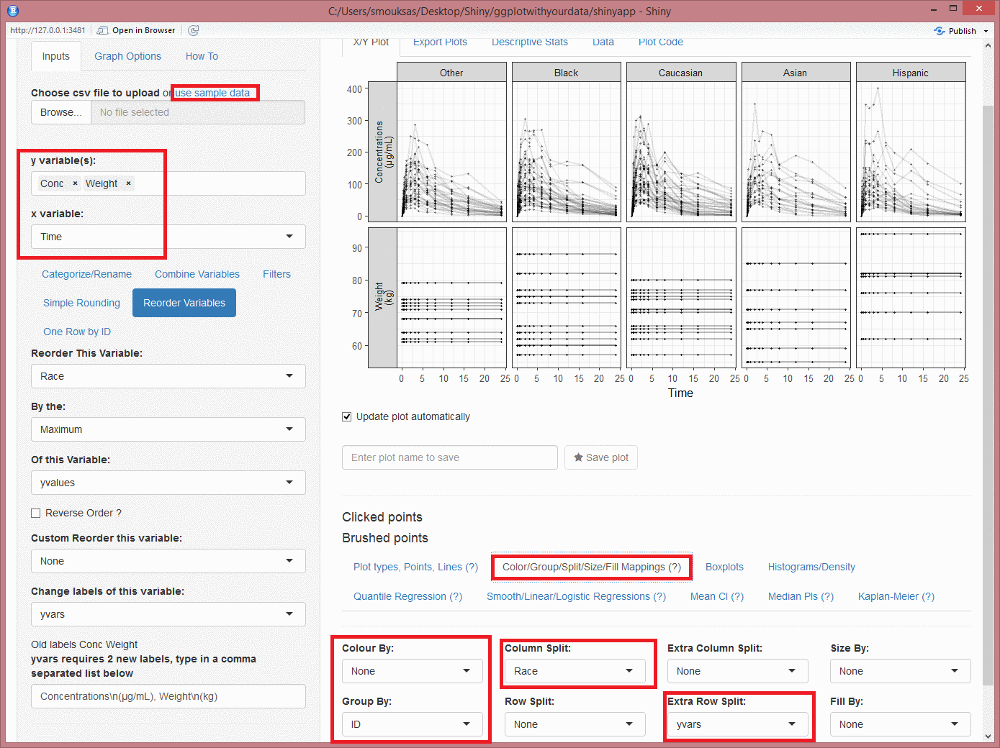
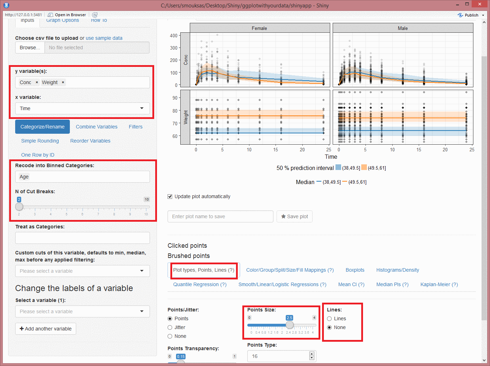
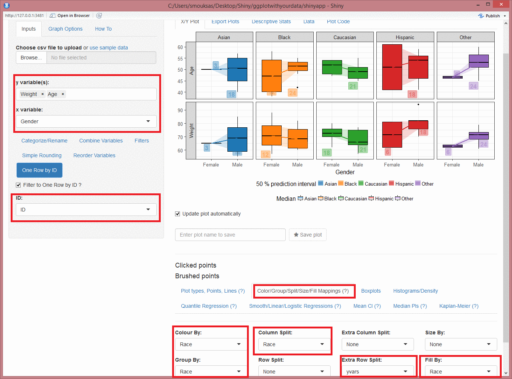
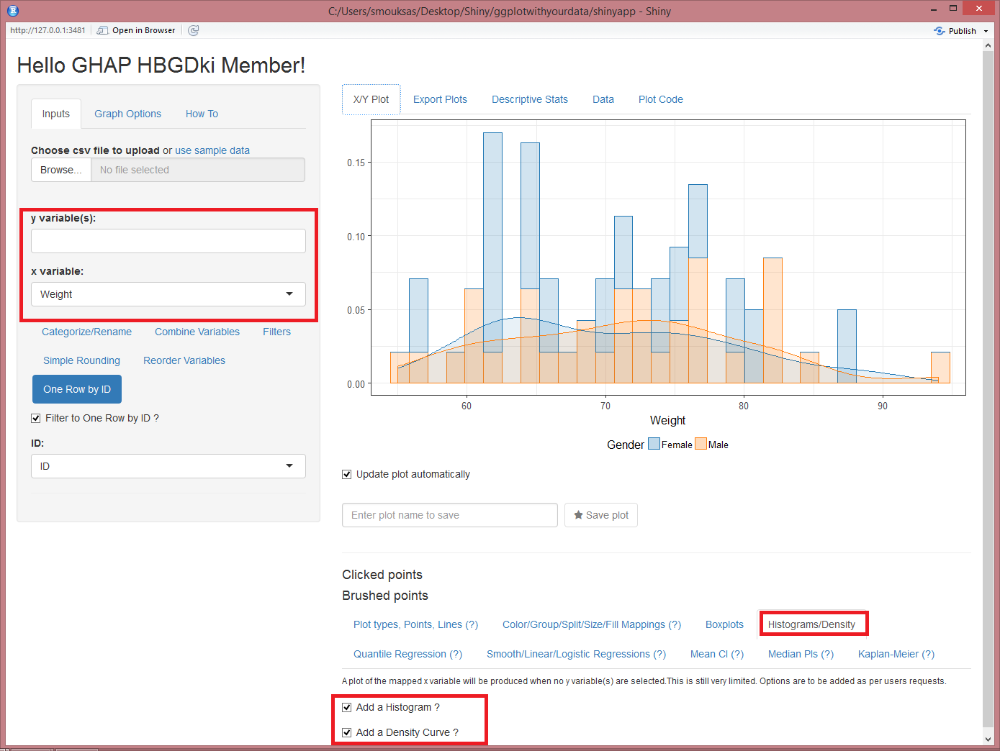

ggplotwithyourdata
========
R Shiny app as a handy inteface to ggplot2. It enables you to quickly explore your data to detect trends on the fly. You can do scatter plots, dotplots, boxplots, barplots, histograms and densities.
For a quick overview head to this <a href="https://www.youtube.com/watch?v=1rBBmJUIZhs" target="_blank"> Youtube Tutorial </a>.

**NEW!!** **Export Plots** and **Plot Code** tabs contributed by <a href="https://github.com/daattali" target="_blank">Dean Attali</a>. Once a plot is saved in the **X/Y Plot** tab by providing a name and hitting the **Save plot** star button it will become available for exporting. You can export in portrait, landscape and multiple plots per page.  
**Plot Code** will let you look at the source code that generated the plot with the various options.

**NEW!!** Initial support for quick summary statistics tables  using  <a href="https://github.com/benjaminrich" target="_blank">Benjamin Rich </a> table1 package. More on this soon.

### CSV Data Input 
* [read.csv("youruploadeddata.csv",na.strings = c("NA","."))]

### Data Manipulations 
* Change continuous variable to be treated as categorical 
* Change continuous variable to categories with a specified number of bins or by supplying values for the bins start/end
* Up to six sequential filters for categorical and continuous variables
* Renaming and reordering of the levels of a categorical variable
* Combining two categorical variables into one
* Rounding a numerical variable to a specified number of digits

### Summary/Regression functions 
* Quantile Regression 
* Smooth/Linear/Logistic Regressions
* Mean Confidence Intervals
* Median Prediction Intervals
* Kaplan-Meier
* Correlation Coefficients

### `ggplot2` built-in functionality
*`facet_grid` and `facet_wrap`
* Group, color, size, fill mappings
* Controlling y and x axis labels, legends and other commonly used theme options.

### Running Information
Make sure to have all required packages installed
shiny, shinyjs, ggplot2, ggrepel, scales, DT, tidyr, dplyr, Hmisc, quantreg, markdown, ggkm abd table1.
The app will try to install ggkm and table1 (if not found) using the commands below:
```
install.packages(c("shiny","shinyjs","ggplot2","scales","DT","tidyr","dplyr","Hmisc","quantreg","markdown","devtools"))
devtools::install_github("sachsmc/ggkm")
devtools::install_github("benjaminrich/table1")
```
Make sure that you are using this version of ggrepel
```
devtools::install_github("slowkow/ggrepel@0.6.6")

```


The main app contains several testing apps the main app can be run using this command:
```
shiny::runGitHub('ggplotwithyourdata', 'smouksassi', subdir = 'shinyapp')
```
Try to reproduce the steps below using the included sample_df.csv.
### Example 1


### Example 2


### Example 3


### Example 4


